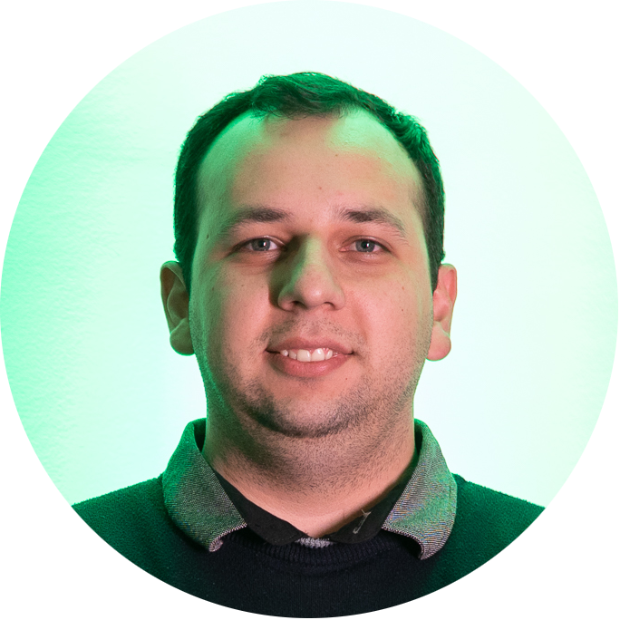

## Hi there!

I'm Leandro Hermes Neto, musician, christian, dad of Théo and husband of Francieli. I live in Concórdia, Santa Catarina, Brazil, where I was born and raised. I've also been a passionate developer since 2012. Already worked with Delphi, then switched to the web part of the force with PHP and JavaScript, which I've been working with since 2014.

Having had a lot of contact with users, I am concerned about the usability of the software, but without neglecting maintainability and the compulsion for clean and neat code. When I met Laravel, I fell in love for beautiful code, then I started to try to always be up-to-date to modern and working good practices in anything I do.

I'm not an enthusiast of new technologies, but I try not to stand still in time, updating myself whenever possible and making use of good practices in software development.

When I can, I automate routinely performed tasks to use my time and effort to focus on development.

---

---

